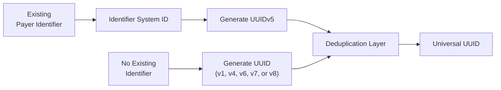

# Federated Payer Identifiers - Building Universal Payer Identifiers Using UUIDs

Every payer generates a new **single universal [UUID](https://en.wikipedia.org/wiki/Universally_unique_identifier)**, regardless of how that payer is identified today.

There are two supported paths:

1. **Existing identifier → UUIDv5**
2. **New identifier → Generated UUID**

All UUIDs pass through a common **deduplication layer** before being accepted into the national registry.

---

## Overview



---

# Path A — Existing Identifiers (UUIDv5)

Use this path when a payer already has an identifier assigned by a recognized authority, that they wish to re-use.

## 1. Select the Identifier System

UUIDv5 generation is supported only for approved payer identifier systems.

Examples include:

| Identifier System ID | Assigning Authority | Status |
|----------------------|---------------------|--------|
| `HIOS_ID` | CMS | Active |
| `CMS_CONTRACT_ID` | CMS | Active |
| `MCO_ID` | State Medicaid Agency | Active |
| `NAIC_ID` | NAIC | Active |
| `X12_PAYER_ID_AVAILITY` | Availity | Active |
| `LEI` | GLEIF | Active |
| ... | Additional approved identifier systems | |

> Only approved Payer Identifier System IDs may be used to generate UUIDv5 values.

The list of approved Payer Identifier Systems is in [tools/current_payer_identification_systems.json](tools/current_payer_identification_systems.json)
If you would like to add a new approved Payer Identifier System, please do a pull request to add to this file!

## 2. Generate the UUID

> **Recommended:** Use the provided CLI tool to generate FPIs correctly:
>
> ```bash
> python tools/FPI_maker_cli.py
> ```
>
> The tool guides you through selecting an identifier system and entering the payer ID value, then prints the generated FPI and the exact Python code needed to reproduce it.

FPI generation uses a **two-step chained UUIDv5** process, not a single `UUIDv5(namespace, value)` call. The identifier system ID is itself first hashed into a UUID5 namespace (using `NAMESPACE_DNS` as the root), and then the payer's identifier value is hashed using that derived namespace:

```
step_1: system_namespace = UUIDv5(NAMESPACE_DNS, "<SYSTEM_ID>.fhir")
step_2: fpi             = UUIDv5(system_namespace, "<payer_id_value>")
```

Example in Python (for `HIOS_ID` / `"987654"`):

```python
import uuid

system_namespace = uuid.uuid5(uuid.NAMESPACE_DNS, "HIOS_ID.fhir")
fpi = str(uuid.uuid5(system_namespace, "987654"))
print(fpi)
```

The `.fhir` suffix is appended to the system ID string before hashing in step 1 — this is a deliberate namespacing convention to avoid collisions with other uses of `NAMESPACE_DNS`.

UUIDv5 is deterministic:

- Same Identifier System ID + same identifier value → same UUID every time
- Different Identifier System ID or identifier value → different UUID

---

# Path B — New Identifiers

Use this path when no existing payer identifier is available.

Typical examples include:

- New payer organizations
- Internal numbering systems
- Proprietary identifiers
- New business entities following mergers or acquisitions

Generate a UUID using any supported UUID version:

| UUID Version | General Purpose |
|---|---|
| **UUIDv1** | Generated from the current **timestamp** and the MAC address of the generating machine. Useful when a time-ordered, traceable identifier is acceptable, but note that it embeds the host's network address, which may raise privacy concerns. |
| **UUIDv4** | **Randomly generated** with 122 bits of entropy. The most widely used version for new identifiers when reproducibility is not required. Suitable for any scenario where a unique, opaque identifier is needed and there is no existing value to hash from. |
| **UUIDv6** | A reordering of the UUIDv1 fields to make the **timestamp sortable** lexicographically. Preferred over UUIDv1 when time-ordered UUIDs are needed and database index performance is a concern. |
| **UUIDv7** | Generated from a **Unix millisecond timestamp** followed by random bits. The recommended choice when monotonically increasing, time-sortable UUIDs are needed, such as for database primary keys or event sequencing. |
| **UUIDv8** | A custom/vendor-specific format with application-defined bit layout. Reserved for cases where an organization needs to **embed proprietary metadata** in a UUID while remaining RFC-compliant. |

Submit the generated UUID for registration.

---

# Deduplication Layer

Every UUID, regardless of how it was generated, follows the same validation process.

```text
Normalize UUID
      ↓
Check Registry
      ↓
Already Exists?
   ├── No  → Accept & Store
   └── Yes → Resolve Collision
```

The NPD deduplication layer:

- Normalizes the UUID to its canonical format.
- Checks against existing Provider and Payer UUIDs.
- Detects duplicate assignments.
- Resolves collisions when necessary.
- Stores the accepted UUID in the National Provider and Payer Directory (NPD).

# National Provider and Payer Directory

The National Provider and Payer Directory serves as the authoritative registry by:

- Validating UUID uniqueness.
- Preventing duplicate payer records.
- Storing payer metadata.
- Returning a canonical universal UUID.

---

# Key Principles

- Use **UUIDv5** when a payer already wishes to use an existing identifier.
- UUIDv5 generation uses a **two-step chained process**: first derive a `system_namespace` via `uuid5(NAMESPACE_DNS, "<SYSTEM_ID>.fhir")`, then compute the FPI via `uuid5(system_namespace, "<payer_id_value>")`.
- Use **`python tools/FPI_maker_cli.py`** to generate FPIs correctly — it handles the two-step chaining automatically.
- UUIDv5 generation requires an approved **Identifier System ID** and the payer's identifier value.
- Use **UUIDv1, UUIDv4, UUIDv6, UUIDv7, or UUIDv8** when creating new payer identifiers with no existing approved identifier provider.
- Every UUID passes through the same deduplication process before being accepted.
- Every accepted UUID is globally unique across all payer identifier systems and UUID versions.
