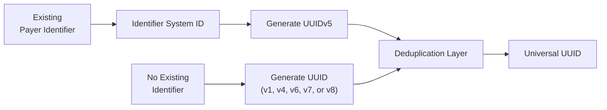

# Federated Payer Identifiers - Building Universal Payer Identifiers Using UUIDs

Every payer receives a **single universal UUID**, regardless of how that payer is identified today.

There are two supported paths:

1. **Existing identifier → UUIDv5**
2. **New identifier → Generated UUID**

All UUIDs pass through a common **deduplication layer** before being accepted into the national registry.

---

## Overview



---

# Path A — Existing Identifiers (UUIDv5)

Use this path when a payer already has an identifier assigned by a recognized authority.

## 1. Select the Identifier System

UUIDv5 generation is supported only for approved payer identifier systems.

Examples include:

| Identifier System ID | Assigning Authority | Status |
|----------------------|---------------------|--------|
| `HIOS_ID` | CMS | Active |
| `CMS_CONTRACT_ID` | CMS | Active |
| `MCO_ID` | State Medicaid Agency | Active |
| `NAIC_ID` | NAIC | Active |
| `X12_PAYER_ID_AVAILITY` | Availity | Active |
| ... | Additional approved identifier systems | |

> Only approved Identifier System IDs may be used to generate UUIDv5 values.

## 2. Generate the UUID

Generate the UUID using the Identifier System ID and the payer's identifier value.

```
UUIDv5(identifier_system_id, identifier_value)
```

Example:

```
UUIDv5("HIOS_ID", "987654")
```

UUIDv5 is deterministic:

- Same Identifier System ID + same identifier value → same UUID
- Different Identifier System ID or identifier value → different UUID

---

# Path B — New Identifiers

Use this path when no existing payer identifier is available.

Typical examples include:

- New payer organizations
- Internal numbering systems
- Proprietary identifiers
- New business entities following mergers or acquisitions

Generate a UUID using any supported UUID version:

- UUIDv1
- UUIDv4
- UUIDv6
- UUIDv7
- UUIDv8

Submit the generated UUID for registration.

---

# Deduplication Layer

Every UUID, regardless of how it was generated, follows the same validation process.

```text
Normalize UUID
      ↓
Check Registry
      ↓
Already Exists?
   ├── No  → Accept & Store
   └── Yes → Resolve Collision
```

The deduplication layer:

- Normalizes the UUID to its canonical format.
- Checks for existing Provider and Payer UUIDs.
- Detects duplicate assignments.
- Resolves collisions when necessary.
- Stores the accepted UUID in the national registry.

---

# Collision Resolution

UUID collisions should be extremely rare.

### UUIDv5

If a UUIDv5 collision occurs:

- Verify the Identifier System ID.
- Verify the identifier value.
- Correct the inputs and regenerate the UUID if necessary.

### Other UUID Versions

If a collision occurs with UUIDv1, UUIDv4, UUIDv6, UUIDv7, or UUIDv8:

- Generate a new UUID.
- Resubmit the new UUID for validation.

All collisions should be logged and available for audit.

---

# National Provider and Payer Directory

The National Provider and Payer Directory serves as the authoritative registry by:

- Validating UUID uniqueness.
- Preventing duplicate payer records.
- Storing payer metadata.
- Returning a canonical universal UUID.

---

# Key Principles

- Use **UUIDv5** when a payer already has an approved identifier.
- UUIDv5 generation requires an approved **Identifier System ID** and the payer's identifier value.
- Use **UUIDv1, UUIDv4, UUIDv6, UUIDv7, or UUIDv8** when creating new identifiers.
- Every UUID passes through the same deduplication process before being accepted.
- Every accepted UUID is globally unique across all payer identifier systems and UUID versions.