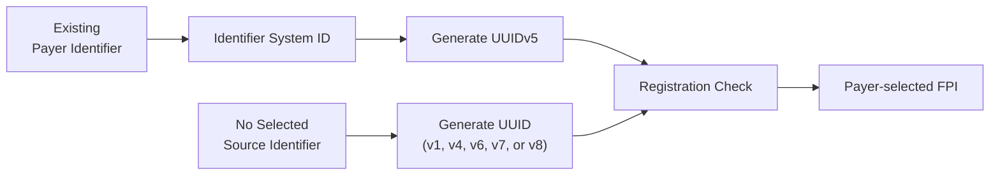

# Federated Payer Identifiers - Building Universal Payer Identifiers Using UUIDs

Every payer self-issues a single
**[UUID](https://en.wikipedia.org/wiki/Universally_unique_identifier)** as its
FPI. Once registered, CMS enforces the payer's selection.

The FPI identifies the legal payer entity that holds the relevant insurance
assets and liability for a beneficiary population. Ownership alone does not
combine legally and financially distinct payer entities into one FPI. This is
important when payers own payers through multiple levels or insure payer risk
through insurance and reinsurance arrangements. Those relationships do not
replace the assets, liability, and beneficiary-population identity boundary.

A payer chooses how to create its FPI; neither this repository nor NPD selects
the source identifier on the payer's behalf.

There are two supported paths:

1. **Existing identifier → UUIDv5**
2. **No source identifier → Generated UUID**

Registration checks that the chosen UUID is syntactically valid and has not
already been claimed. Registration does not make FPIs generated from different
source identifiers converge.

---

## Overview


```mermaid
flowchart LR

A["Existing<br/>Payer Identifier"]
B["Identifier System ID"]
C["Generate UUIDv5"]

D["No Selected<br/>Source Identifier"]
E["Generate UUID<br/>(v1, v4, v6, v7, or v8)"]

F["Registration Check"]
G["Payer-selected FPI"]

A --> B --> C --> F
D --> E --> F
F --> G
```

---

## Path A — Existing Identifiers (UUIDv5)

Use this path when a payer already has an identifier assigned by a recognized authority, that they wish to re-use.

### 1. Select the Identifier System

UUIDv5 generation in this repository is supported for the enumerated payer
identifier systems. The payer decides whether to use one of these identifiers,
and which one to use. Different choices intentionally produce different UUIDs.

Examples include:

| Identifier System ID | Assigning Authority | Status |
|----------------------|---------------------|--------|
| `HIOS_ID` | CMS | Active |
| `CMS_CONTRACT_ID` | CMS | Active |
| `STATE_MCO_ID` | State Medicaid Agency | Active |
| `STATE_DOI_ID` | State Department of Insurance | Active |
| `NAIC_ID` | NAIC | Active |
| `X12_PAYER_ID_AVAILITY` | Availity | Active |
| `LEI` | GLEIF | Active |
| ... | Additional enumerated identifier systems | |

> Only enumerated Payer Identifier System IDs may be used with this
> repository's UUIDv5 tooling.

> **Caution on `CMS_CONTRACT_ID`:** contract numbers identify *contracts*, not payer legal entities. One payer can hold many contracts, and contracts can move between payers. This repository's automated seeding therefore never derives an FPI from a contract number (it uses `LEGAL_NAME_HASH` instead — see below). A payer may still *elect* one of its own contract numbers as its preeminent identifier and derive its FPI from it, but that is the payer's choice, never a tooling default.

The list of enumerated Payer Identifier Systems is in
[`reference_data/current_payer_identification_systems.json`](reference_data/current_payer_identification_systems.json).
To propose another system, submit a pull request that adds it to that file.

Note that the FPI itself (`FPI`) is also listed in that file as a payer identifier system, so that FPIs can be recorded and crosswalked alongside every other payer identifier. However, the `FPI` system may **not** be used as an FPI source namespace — you cannot derive an FPI from another FPI, and the FPI Maker CLI excludes it from the selectable namespaces.

### State-level identifier systems require a state prefix

Some identifier systems (currently `STATE_DOI_ID` and `STATE_MCO_ID`) are assigned by individual states, and their values are only unique *within* a single state. Texas DOI number `68775` and some other state's DOI number `68775` would otherwise hash to the same FPI.

To prevent these collisions, values from state-level identifier systems MUST be prefixed with the two-letter USPS state code and a hyphen before the UUIDv5 is generated:

```
TX-68775   (Texas DOI number 68775)
OH-12345   (Ohio DOI number 12345)
```

The FPI Maker CLI prompts for the state code automatically for these systems, and the `generate_fpi` library function rejects unprefixed state-level values.

### The `LEGAL_NAME_HASH` system requires name normalization

The `LEGAL_NAME_HASH` system hashes a payer's legal name. It exists as a temporary seeding hack: the legal name is the only payer attribute reliably available to CMS at seed time, so the Medicare Advantage seeder derives its initial FPIs from it. Payers are expected to replace these seeded FPIs with FPIs derived from real identifier systems (`NAIC_ID`, `HIOS_ID`, `LEI`, a state-prefixed `STATE_DOI_ID`, etc.).

Before hashing, the legal name is always normalized:

```text
lowercase the name, then remove every character that is not a-z or 0-9
"AETNA HEALTH, INC."  →  "aetnahealthinc"
```

This normalization is implemented once, inside `tools/FPI_maker_cli.py` (`normalize_legal_name`), and `generate_fpi` applies it automatically whenever `system_id == "LEGAL_NAME_HASH"` — so passing the raw legal name and the pre-normalized name produce the same FPI. Callers must never reimplement this normalization.

### 2. Generate the UUID

> **Recommended:** Use the provided CLI tool to generate FPIs correctly:
>
> ```bash
> python tools/FPI_maker_cli.py
> ```
>
> The tool guides you through selecting an identifier system and entering the payer ID value, then prints the generated FPI and the exact Python code needed to reproduce it.

FPI generation uses a **two-step chained UUIDv5** process, not a single `UUIDv5(namespace, value)` call. The identifier system ID is itself first hashed into a UUID5 namespace (using `NAMESPACE_DNS` as the root), and then the payer's identifier value is hashed using that derived namespace:

```
step_1: system_namespace = UUIDv5(NAMESPACE_DNS, "<SYSTEM_ID>.fhir")
step_2: fpi             = UUIDv5(system_namespace, "<payer_id_value>")
```

For state-level systems, the `<payer_id_value>` must already carry the two-letter state prefix (e.g. `"TX-68775"`), as described above.

Example in Python (for `HIOS_ID` / `"987654"`):

```python
import uuid

system_namespace = uuid.uuid5(uuid.NAMESPACE_DNS, "HIOS_ID.fhir")
fpi = str(uuid.uuid5(system_namespace, "987654"))
print(fpi)
```

The `.fhir` suffix is appended to the system ID string before hashing in step 1 — this is a deliberate namespacing convention to avoid collisions with other uses of `NAMESPACE_DNS`.

All FPI uuid generation logic in this repository lives in exactly one place: `tools/FPI_maker_cli.py`. Other tools (including the Medicare Advantage seeder) import from it rather than reimplementing the hashing. Its correctness is validated by the test suite in `tools/tests/test_FPI_maker_cli.py`:

```bash
python3 tools/tests/test_FPI_maker_cli.py
```

UUIDv5 is deterministic:

- Same Identifier System ID + same identifier value → same UUID every time
- Different Identifier System ID or identifier value → different UUID

---

## Path B — New Identifiers

Use this path when the payer does not want to derive its FPI from an existing
identifier.

The payer may generate an FPI using any of these UUID versions:

| UUID Version | General Purpose and Considerations |
|---|---|
| **UUIDv1** | Generated from a timestamp and the generating machine's MAC address. It can support time ordering and traceability, but it exposes timing and network-address information that may create privacy concerns. |
| **UUIDv4** | Randomly generated with 122 bits of entropy. It is widely supported, opaque, and appropriate when reproducibility or time ordering is unnecessary. A cryptographically secure UUID implementation should be used. |
| **UUIDv6** | Reorders UUIDv1 fields so timestamp values sort lexicographically. It can be useful for time-ordered storage but retains UUIDv1-style node and timing considerations. |
| **UUIDv7** | Combines a Unix-millisecond timestamp with random bits. It is useful when a payer wants a time-sortable identifier without UUIDv1's MAC-address construction. |
| **UUIDv8** | Uses an application-defined, RFC-compatible bit layout. It is appropriate when a payer deliberately needs a custom UUID format and has documented how that format is generated. |

These versions are all acceptable FPI choices. UUIDv4 is common, but it is not
the only permitted generated UUID mechanism. The payer is responsible for
understanding the privacy, ordering, opacity, and custom-format consequences of
its selection.

Submit the payer-selected UUID for registration.

---

## Registration Check

Every UUID, regardless of how it was generated, follows the same basic
registration process.

```text
Normalize UUID
      ↓
Check Registry
      ↓
Already Claimed?
   ├── No  → Register payer-selected FPI
   └── Yes → Payer selects another FPI
```

The registration process normalizes and validates UUID syntax and rejects an
already-claimed value. It records and republishes the payer's choice; it does
not return a replacement canonical UUID or infer that two different FPIs refer
to the same payer.

During the initial implementation, this repository is the trusted working
copy. NPD is expected to republish accepted payer and endpoint data. The future
operational registration and enforcement workflow is not yet implemented here.
See [Future Steps](FutureSteps.md).

---

## Key Principles

- Use **UUIDv5** when a payer already wishes to use an existing identifier.
- UUIDv5 generation uses a **two-step chained process**: first derive a `system_namespace` via `uuid5(NAMESPACE_DNS, "<SYSTEM_ID>.fhir")`, then compute the FPI via `uuid5(system_namespace, "<payer_id_value>")`.
- Use **`python tools/FPI_maker_cli.py`** to generate FPIs correctly — it handles the two-step chaining automatically, and loads the enumerated identifier systems at runtime from `reference_data/current_payer_identification_systems.json`.
- UUIDv5 generation with this repository's tooling requires an enumerated **Identifier System ID** and the payer's identifier value.
- **All FPI hashing logic lives in one place** — `tools/FPI_maker_cli.py` — and is validated by `tools/tests/test_FPI_maker_cli.py`. Never reimplement it.
- **`LEGAL_NAME_HASH` values are always normalized** (lowercased, all non a-z0-9 characters removed) inside `FPI_maker_cli` before hashing. It is a temporary seeding hack; payers should replace name-hash FPIs with FPIs from real identifier systems.
- **Never default to `CMS_CONTRACT_ID` as an FPI source** — contract numbers identify contracts, not payer entities. A payer may elect a contract number as its preeminent identifier, but tooling never assumes it.
- **State-level identifier values** (e.g. `STATE_DOI_ID`, `STATE_MCO_ID`) must be prefixed with the two-letter USPS state code and a hyphen (e.g. `TX-68775`) before hashing, to prevent collisions between states.
- The **FPI itself is listed** in the payer identifier systems file so it can be crosswalked like any other identifier, but it may not be used as an FPI source namespace — you cannot derive an FPI from another FPI.
- Use **UUIDv1, UUIDv4, UUIDv6, UUIDv7, or UUIDv8** when the payer does not want to base its FPI on another identifier.
- The payer's choice of a source identifier is not a ranking of identifier systems.
- FPIs based on different source identifiers do not converge automatically.
- Registration rejects a UUID already claimed as an FPI but does not perform entity resolution.
