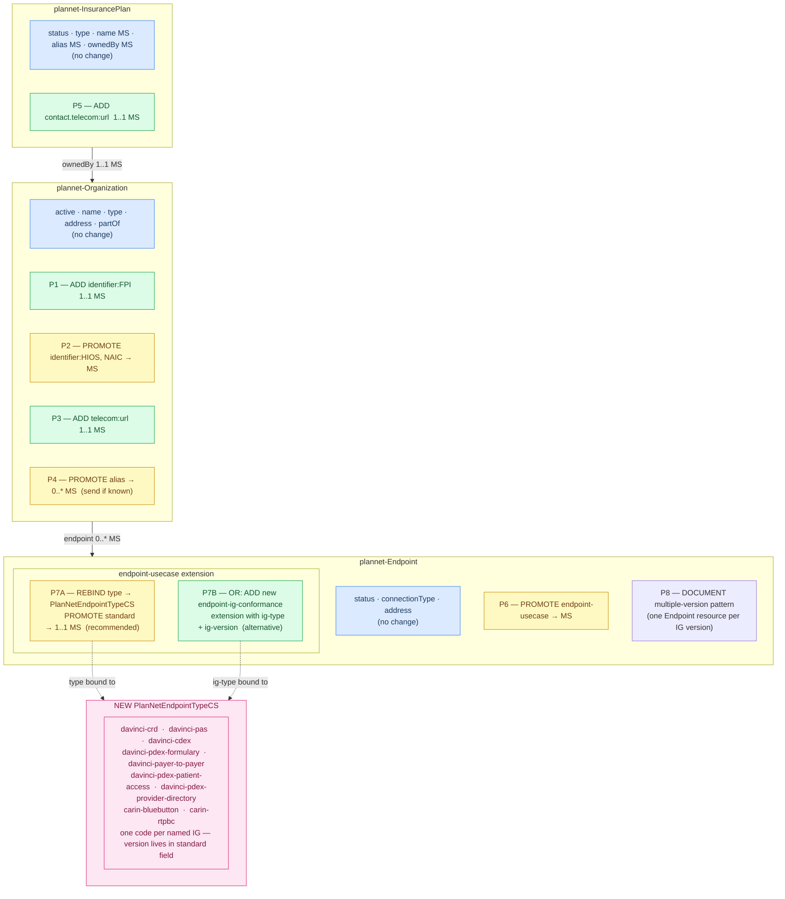

# Plan-Net Data Model — Proposed Changes

The diagram below shows the three Plan-Net resources affected by this proposal
and every element-level change. Node colour indicates the nature of each change.

## Legend

| Colour | Meaning |
|---|---|
| 🔵 Blue | Existing element — no change required |
| 🟢 Green | New element or slice being added |
| 🟡 Yellow | Existing element being promoted to MustSupport |
| 🩷 Pink | New CodeSystem being defined |
